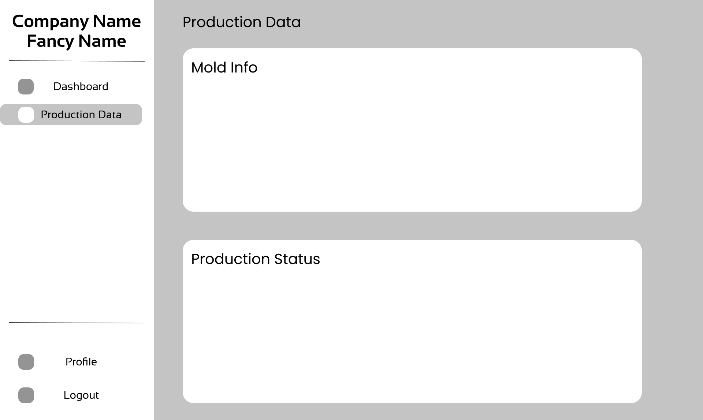
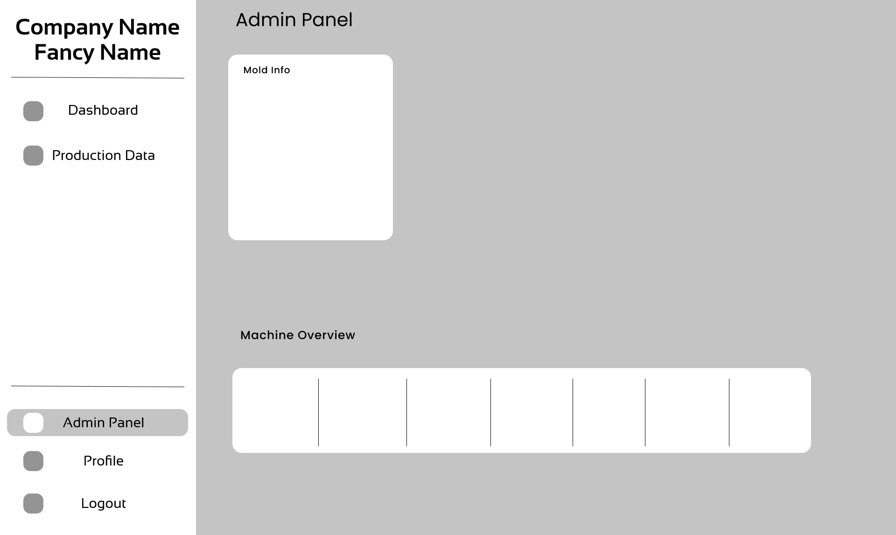

# Dashbaord Wireframe

## Dashboard

Here the user can get an overview of the performance of the system.

## Production Data

The user can get an idea about the overall producion, molds, and the other important production data.

## Machinewise Details Page

User can get an overview of the performance of the algorithm respective machine.

## Admin Panel

This panel can be only accessible by the admin. From here the admin panel can get an overview of the system and the performance of the algorithms. 

