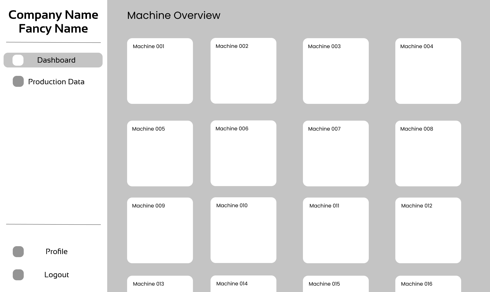
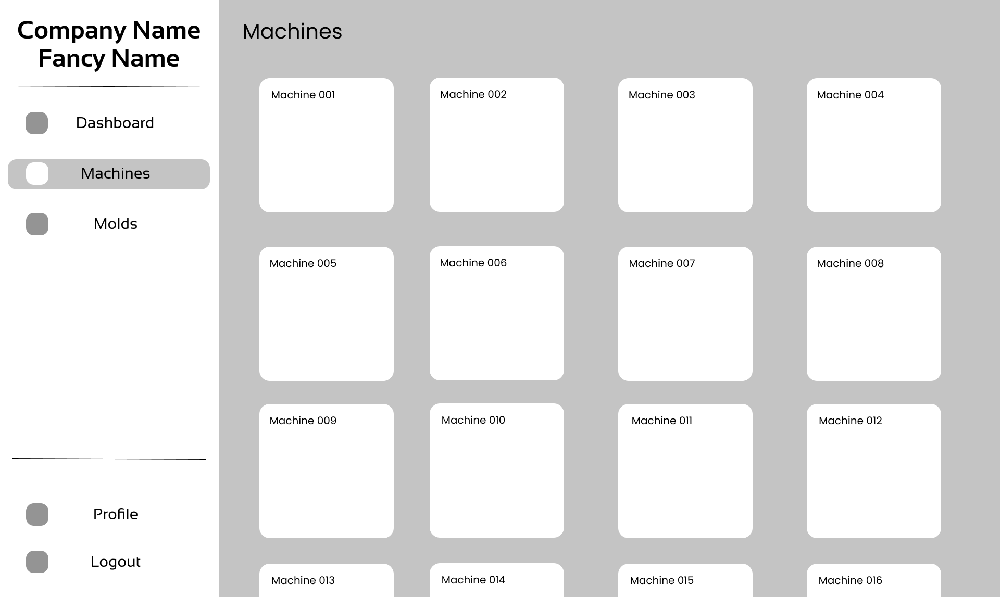
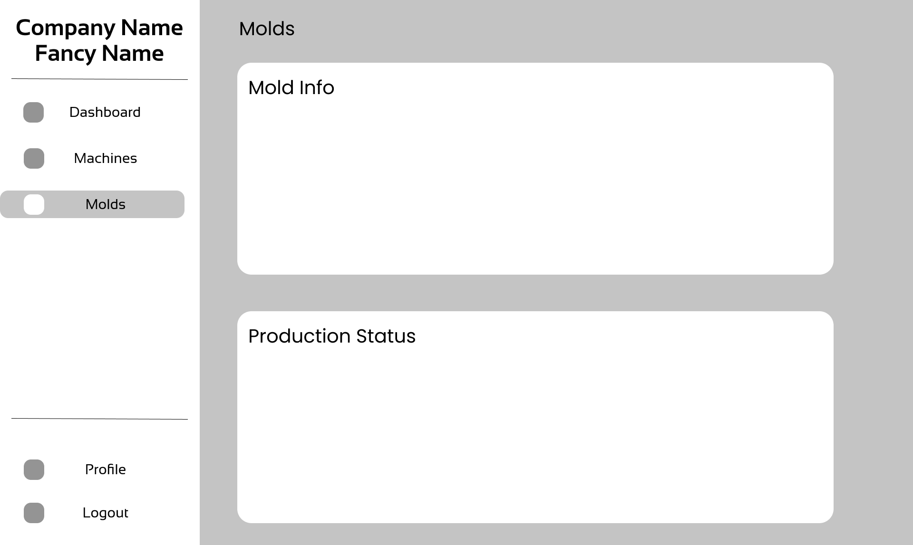
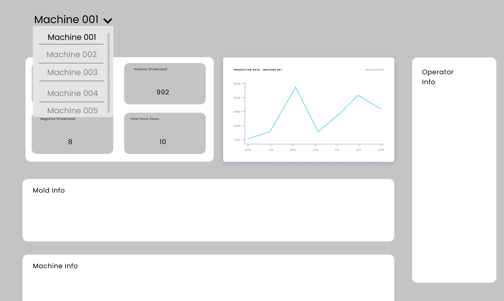

# Dashbaord Wireframe

## Dashboard

Here the user can get an overview of the performance of the system.

## Machines Pannel

The user can get usefull details about every machine in the system through a tile layout.

## Molds Pannel

The user can get an idea about the mold and the materials that is being used in the batch.

## Machinewise Details Page

User can get an overview of the performance of the respective machine.

