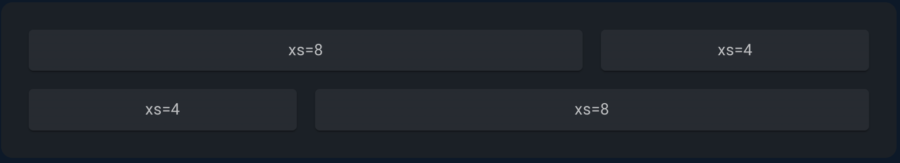
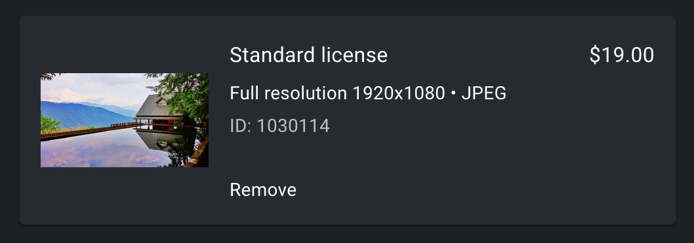

# React Grids

Material UI provides a grid system for React which is the most widely used grid component by react developers. It is based on the [Flexbox](https://css-tricks.com/snippets/css/a-guide-to-flexbox/) and is designed to be used with the [Material Design](https://material.io/design/) guidelines. It is a simple, flexible, and extensible grid system that can be used to layout content. There are five grid breakpoints: xs, sm, md, lg, and xl. The breakpoint sizes are defined in the Material Design specification.

A basic grid can be developed using the [`Grid`](https://material-ui.com/api/grid/) component as shown below.

```jsx
<Grid container spacing={2}>
  <Grid item xs={8}>
    <Item>xs=8</Item>
  </Grid>
  <Grid item xs={4}>
    <Item>xs=4</Item>
  </Grid>
  <Grid item xs={4}>
    <Item>xs=4</Item>
  </Grid>
  <Grid item xs={8}>
    <Item>xs=8</Item>
  </Grid>
</Grid>
```


Here the column widths are integer values between 1 and 12; they apply at any breakpoint and indicate how many columns are occupied by the component.

The whole documentation can be found [here](https://material-ui.com/components/grid/). 

Out of them the feature that might be important to us would be the complx grid. This can bed used to develop complex layouts (maybe for each machine, mold etc in our project).

```jsx
<Grid container spacing={2}>
        <Grid item>
          <ButtonBase sx={{ width: 128, height: 128 }}>
            
          </ButtonBase>
        </Grid>
        <Grid item xs={12} sm container>
          <Grid item xs container direction="column" spacing={2}>
            <Grid item xs>
              <Typography gutterBottom variant="subtitle1" component="div">
                Standard license
              </Typography>
              <Typography variant="body2" gutterBottom>
                Full resolution 1920x1080 • JPEG
              </Typography>
              <Typography variant="body2" color="text.secondary">
                ID: 1030114
              </Typography>
            </Grid>
            <Grid item>
              <Typography sx={{ cursor: 'pointer' }} variant="body2">
                Remove
              </Typography>
            </Grid>
          </Grid>
          <Grid item>
            <Typography variant="subtitle1" component="div">
              $19.00
            </Typography>
          </Grid>
        </Grid>
      </Grid>
```

